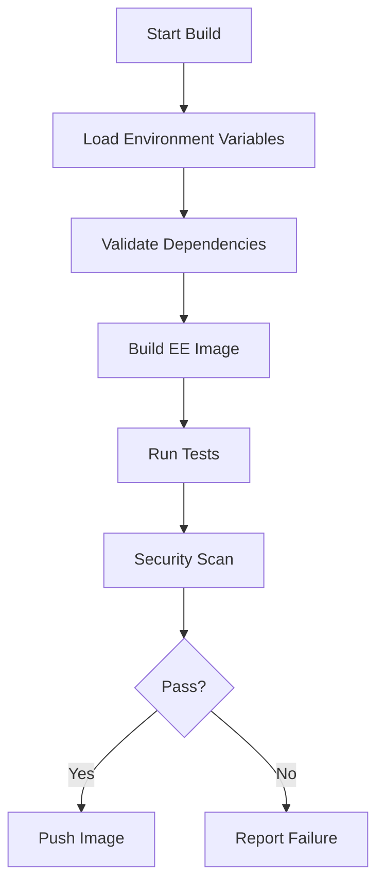
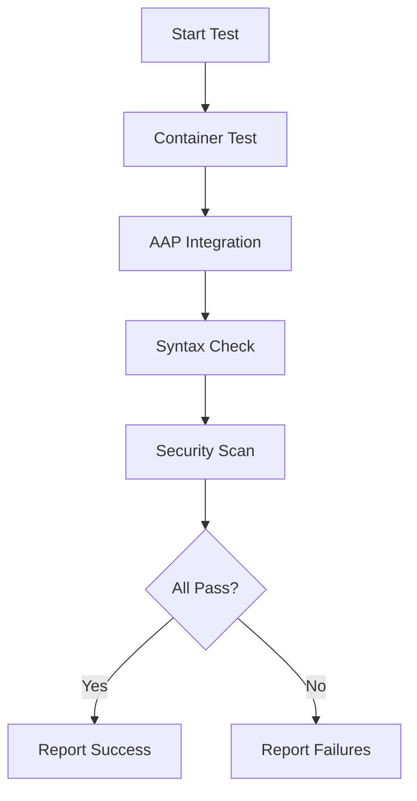
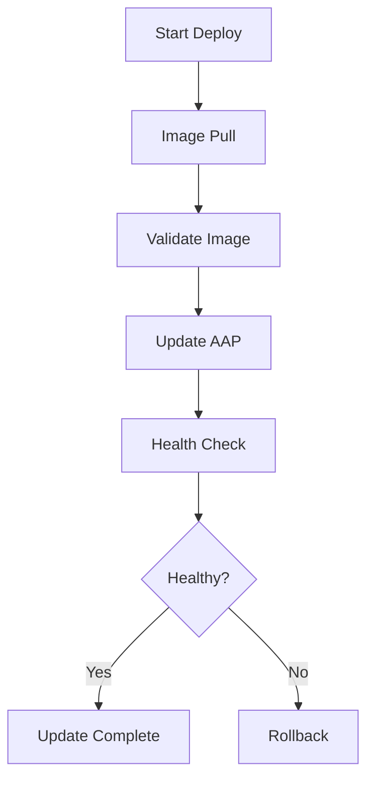
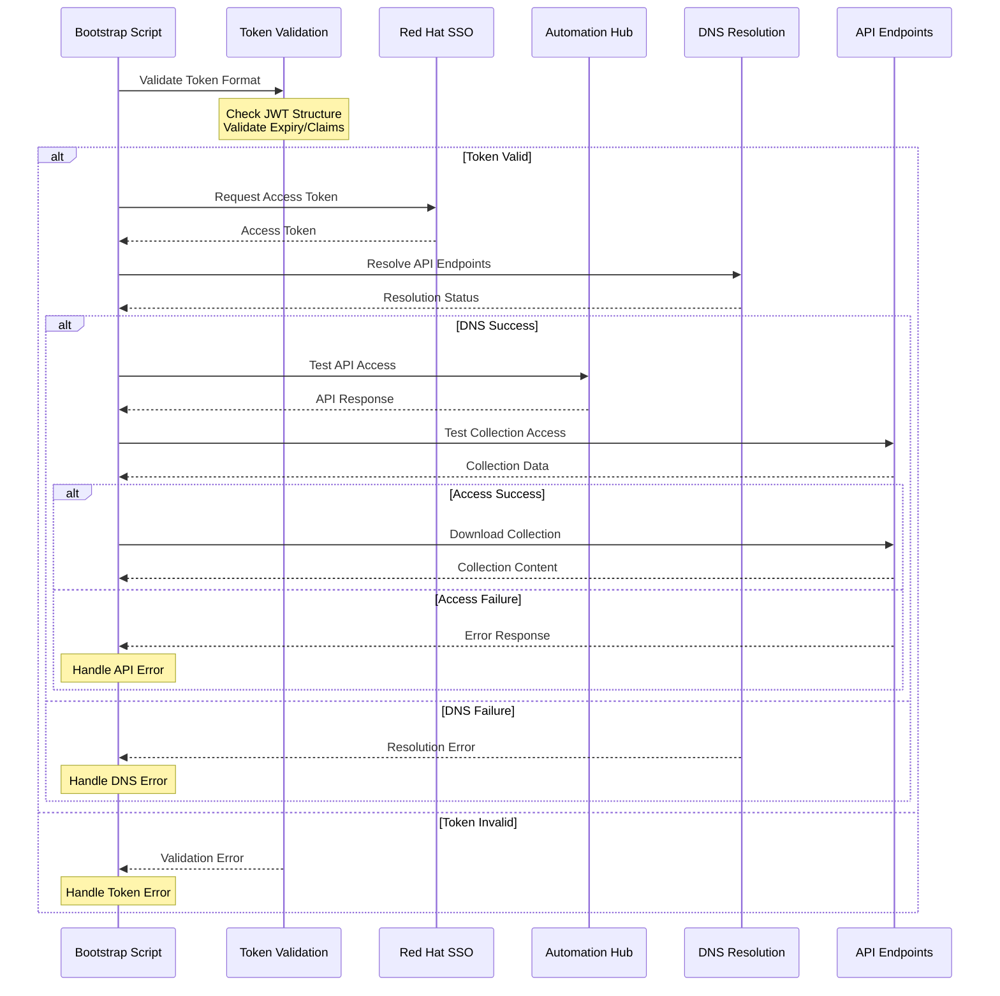
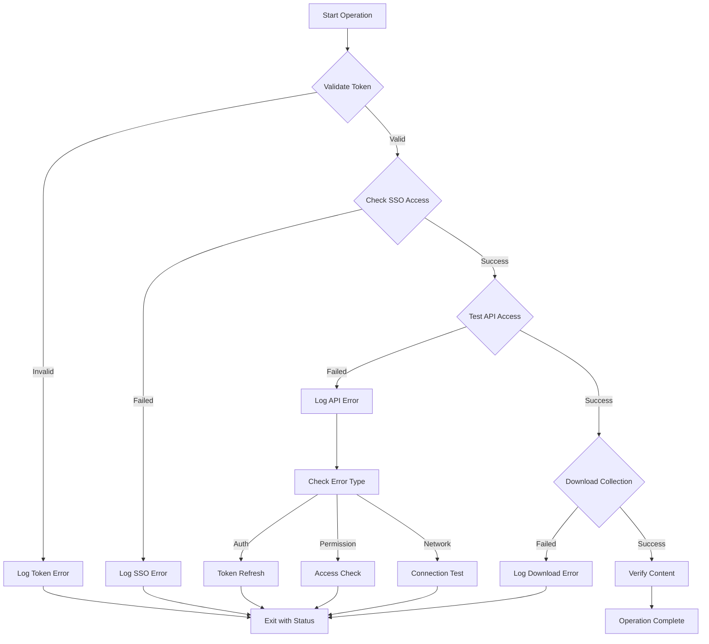
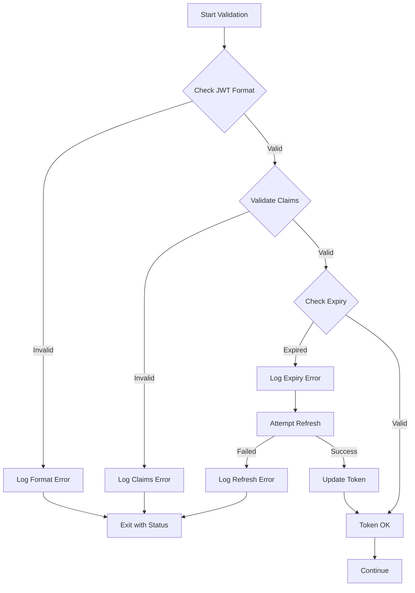

# [ADR-0004] Logical Flow Diagrams

## Status

Accepted

## Context

Complex automation processes in Ansible Execution Environments need clear visualization to:
- Help team members understand process flows
- Document system interactions
- Aid in troubleshooting
- Support onboarding and knowledge transfer

## Decision

We will implement standardized logical flow diagrams using Mermaid.js for the following processes:

1. Build Process Flow:

2. Test Process Flow:

3. Deployment Flow:

4. Authentication Flow:

5. Error Handling Flow:

6. Token Validation Flow:

Standards:
1. Use Mermaid.js for all diagrams
2. Follow left-to-right or top-down flow
3. Use consistent shapes:
   - Rectangles for processes
   - Diamonds for decisions
   - Rounded rectangles for start/end
4. Include diagram source in markdown files
5. Keep diagrams focused and simple

## Consequences

### Positive
- Clear visual documentation
- Self-documenting processes
- Easy to maintain with source control
- Rendered directly in GitHub/GitLab
- Consistent visualization across project

### Negative
- Need to learn Mermaid.js syntax
- Additional documentation to maintain
- May need external tools for editing
- Limited styling options

## Alternatives Considered

1. **Draw.io/Diagrams.net**
   - More feature-rich
   - Binary files in repo
   - Harder to version control
   - Rejected for maintainability

2. **PlantUML**
   - Similar features
   - Requires external server/tools
   - Less GitHub integration
   - Rejected for complexity

3. **ASCII Art Diagrams**
   - Simple to create
   - Limited capabilities
   - Hard to maintain
   - Rejected for scalability

## References

- [Mermaid.js Documentation](https://mermaid.js.org/)
- [GitHub Mermaid Support](https://github.blog/2022-02-14-include-diagrams-markdown-files-mermaid/)
- [Diagram Best Practices](https://www.lucidchart.com/blog/how-to-make-a-flow-chart)

## Notes

- Consider automated diagram validation
- Keep diagrams up to date with code changes
- Use consistent naming conventions
- Include legends for complex diagrams 