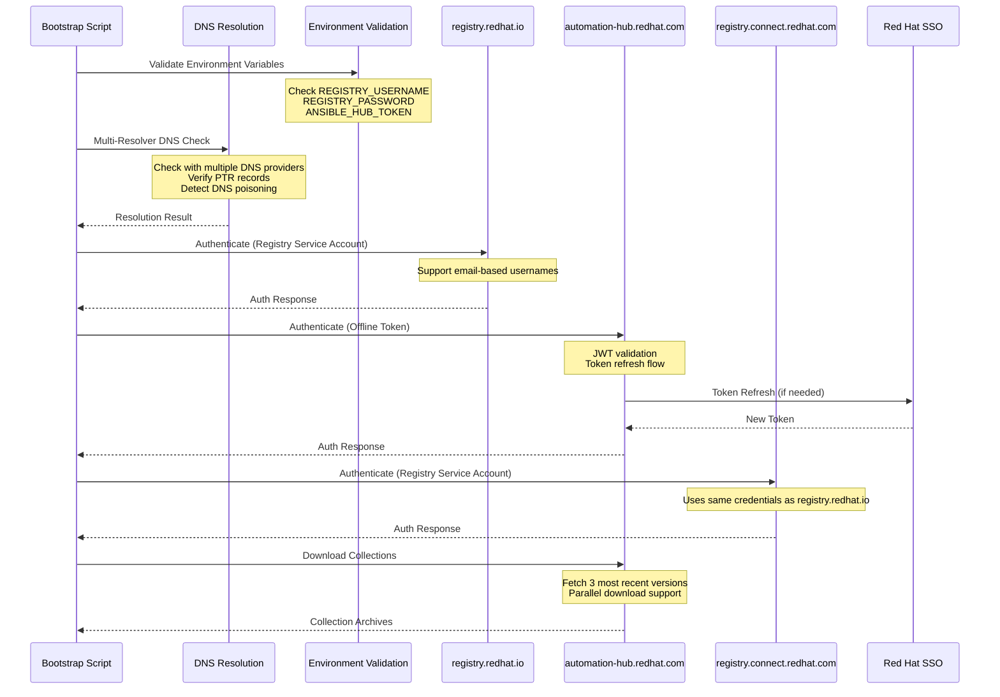

# [ADR-0006] Authentication Flow and Token Handling

## Status

Accepted and Implemented

## Context

The Ansible Execution Environment requires secure authentication with multiple Red Hat services:
- registry.redhat.io (Registry Service Account Token)
- automation-hub.redhat.com (API/Offline Token)
- registry.connect.redhat.com (Registry Service Account Token)

We need to establish secure, reliable authentication flows and token handling procedures.

## Decision

### 1. Authentication Flow Design



### 2. Token Handling Standards

1. Token Acquisition:
   - Registry Service Account Tokens: Obtained via Red Hat Customer Portal
   - Automation Hub Offline Token: Obtained via Red Hat Hybrid Cloud Console
   - Support for email-based usernames in Registry Service Account
   - No hardcoding of tokens in scripts or configuration files

2. Token Storage:
   - Environment variables or secure credential store only
   - No plaintext storage in logs or files
   - Secure handling in memory
   - Regular token rotation with refresh mechanism

3. Token Validation:
   - Pre-authentication token format validation
   - JWT structure and claims validation
   - Token expiration checking and automatic refresh
   - Support for both standard and email-based usernames
   - Secure error handling without token exposure

### 3. Security Controls

1. DNS Security:
   - Multi-resolver DNS validation (Cloudflare, Google, Quad9)
   - Connectivity checks to DNS resolvers
   - Cross-validation of DNS responses
   - PTR record verification
   - DNS poisoning detection
   - Timeout and retry mechanisms

2. Error Handling:
   - Specific error messages without exposing sensitive data
   - Proper exit codes for different failure modes
   - Detailed logging with security considerations
   - Color-coded output for better visibility
   - Structured error reporting

3. Access Control:
   - Principle of least privilege
   - Separate tokens for different services
   - Regular token rotation capability
   - Automatic token refresh when needed
   - File permission validation

### 4. Collection Management

1. Version Control:
   - Automatic download of three most recent versions
   - Version comparison and sorting
   - Cleanup of failed downloads
   - Success/failure tracking per version

2. API Integration:
   - Dynamic API version detection
   - Proper URL construction
   - Robust error handling
   - Download verification

## Consequences

### Positive
- Enhanced security through multi-resolver DNS checks
- Robust token validation with JWT support
- Automatic token refresh capability
- Support for email-based usernames
- Better error handling and debugging
- Compliance with security best practices
- Improved collection version management
- Automatic handling of multiple versions

### Negative
- Additional complexity in setup
- More maintenance overhead
- Need for secure token management
- Regular token rotation requirements
- Increased DNS resolution time
- Storage requirements for multiple collection versions

## Implementation Notes

1. Token Validation:
   ```bash
   # JWT token validation with expiry check
   validate_jwt "$ANSIBLE_HUB_TOKEN"
   
   # Registry username validation (supports email)
   validate_email "user@example.com"
   ```

2. DNS Security:
   ```bash
   # Multi-resolver DNS check with PTR verification
   validate_dns "registry.redhat.io"
   ```

3. Collection Management:
   ```bash
   # Download multiple collection versions
   download_collections "$access_token"
   ```

4. Registry Authentication:
   ```bash
   # Authenticate with both registries using same credentials
   podman login registry.redhat.io
   podman login registry.connect.redhat.com
   ```

## References

- [Red Hat Registry Authentication](https://access.redhat.com/RegistryAuthentication)
- [Automation Hub Documentation](https://console.redhat.com/ansible/automation-hub/)
- [OAuth 2.0 Best Practices](https://datatracker.ietf.org/doc/html/draft-ietf-oauth-security-topics)
- [NIST SP 800-63B Digital Identity Guidelines](https://pages.nist.gov/800-63-3/sp800-63b.html)
- [DNS Security Best Practices](https://www.icann.org/resources/pages/dnssec-what-is-it-why-important-2019-03-05-en)

## Notes

- Regular security audits required
- Token rotation procedures documented
- Automated token validation implemented
- DNS security enhanced with multiple resolvers
- Support added for email-based usernames
- Collection version management automated
- Registry authentication unified 